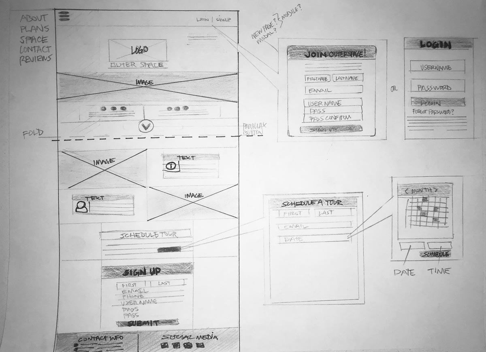
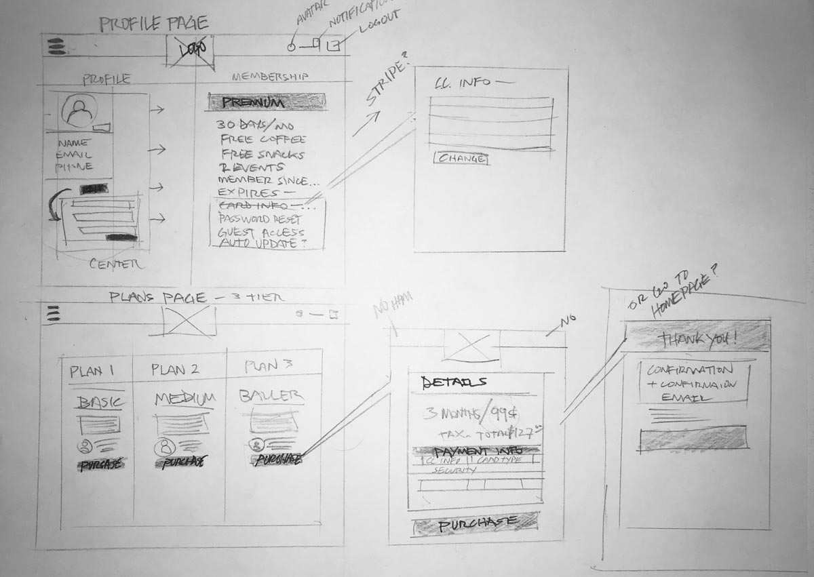
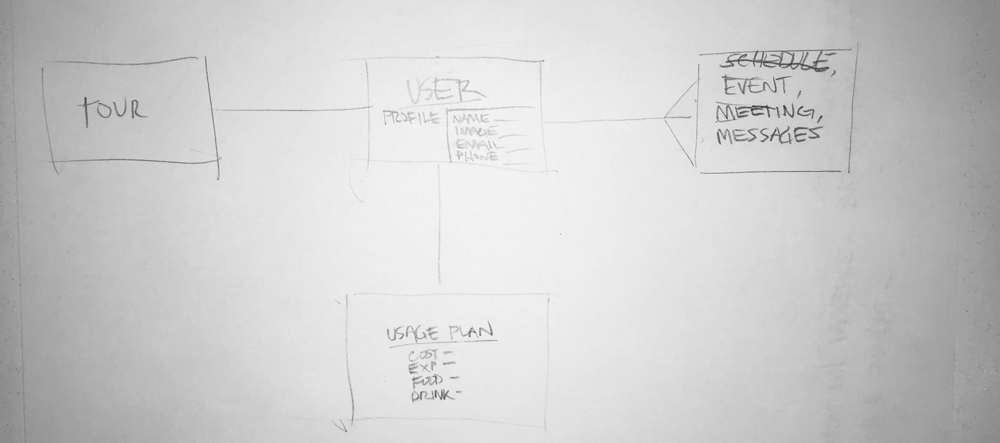
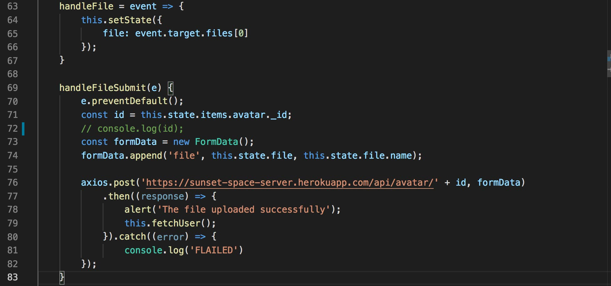
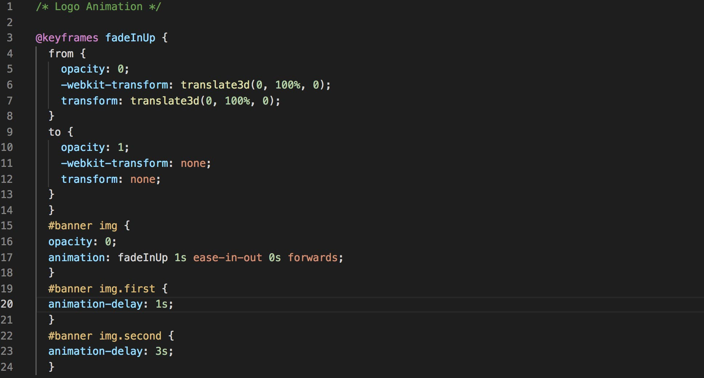

# Final Project

## sunset-space.herokuapp.com

### This project is a website for a 'FREEMIUM' based business. The business- 'Sunset Space' is a hypothetical co-working space in the Outer Sunset, SF.

==================================

### MERN Stack

* Mongoose/MongoDB
* Express
* React
* Node

##### Other Technologies Used

* JWT - Authentication (explain)
    * A JSON web token, encrypted container format that is used to securely transfer information between two parties. JWTs are credentials, which can grant access to resources.
* Multer - Image upload (explain)
    * Multer is a node.js middleware for handling multipart/form-data
* Stripe API - Payments
* Vanilla JavaScript - Functionality
* CSS3 - Animations/Styles
* SASS/SCSS - Navigation

===================================

### Process/ Approach

* Research

* User Story
    * User can visit / to see a landing page
    * User can Login or Register
    * User can navigate to see the plans for membership without being logged in.
    * User can navigate to see the plans for membership without being logged in.
    * Logged in User will be directed to a profile page.
    * Logged in User can edit/update the profile information.
    * Logged in User can upload, refresh profile photo.
    * Looged in User can logout and be redirected to signin page.

* Wireframes

* ERD (Entity Relationship Diagram)

* Sprint 1: Back-End Build Out
    * Define express, mongoose
    * Define Ports, and DB
    * Create Models
    * Create Routes, Controllers
    * Back-End Testing
    * Use Postman to test all CRUD

* Sprint 2: Front-End Boiler Plate
    * Skeleton- createforms, cards
    * JWT Auth
    * Sign In/Out
    * Logic/Funcionality
    * Test Front-End, Back-End connection
    * Axios GET, POST, PUT, DELETE

* Sprint 3: Stripe API
    * Stripe Tutorial
    * Stripe Integration into project
    * Stripe Testing

* Sprint 4 Multer
    * Multer Tutorial
    * Multer Integration
    * Create new API avatar endpoint

* Sprint 5: Heroku

* Deploy, debug, changes
* Deploy, debug, changes
* Deploy, debug, changes
* Deploy, debug, changes
* Deploy, debug, changes
* Deploy, debug, changes
* Deploy, debug, changes
* Deploy, debug, changes
* Deploy, debug, changes
* Deploy, debug, changes
* Deploy, debug, changes
* Deploy, debug, changes
* Deploy, debug, changes
* Deploy, 229 more times

* Sprint 6: Front-End Polish
    * Fonts/Styles/CSS/SASS
    * UI/UX, Flow etc
    * Navbar overlay, animation
    * Built out, test
    * Re-deploy to Heroku (😬)

* Sprint 7: Fix Bugs
    * Responsive check
    * Media Queries
    * ...

===================================

## Unsolved Problems
* Issues with on Delete of User
* Issues with Stripe Button/Customization
* Issues with Heroku Latency
* Date format

## Wins/Challenges

### Code blocks...

#### Challenges
> Multer, new challenge especially to refresh the profile image automatically.
> Focus on the plan Strategize and implement.
> jQuery incompatible with React.
> Heroku!!!

#### Wins
> Step-by-step...was able to move forward by breaking into small bite-size chunks.
> Learned React! First working full stack app!
> From the ground up, not a tutorial!
> Tamed the Heroku beast!

#### THANK YOU
To everyone, especially the instructors- Kenny and Brock!

